# SparrowML

SparrowML is a hardware-aware edge-AI compiler and runtime that trains and quantizes a human-activity-recognition model, lowers it into a deterministic deployment package, and validates exact integer execution through Sparrow-V RTL simulation.

It is a compact hardware-software co-design project: a subject-held-out WISDM activity-recognition model is trained in FP32, evaluated with explicit INT8 arithmetic, compiled into a package, and checked against a custom RISC-V processor with INT8 vector execution. SparrowML owns the software pipeline; [Sparrow-V](docs/decisions/ADR-001-repository-boundary.md) is an external, unmodified target checkout.

## Motivation

Edge-AI claims are useful only when data splitting, quantization semantics, compiler artifacts, and target execution can be audited together. SparrowML keeps that path small and inspectable: it uses deterministic preprocessing, train-only calibration, a fixed two-layer MLP, versioned artifacts, and exact intermediate comparisons rather than treating a floating-point prediction as sufficient deployment evidence.

## System overview

```mermaid
flowchart LR
  subgraph S["SparrowML software"]
    A[WISDM raw phone accelerometer data] --> B[Subject-safe 80-sample windows]
    B --> C[16-feature extraction]
    C --> D[FP32 16→16→4 MLP training]
    D --> E[Train-only INT8 calibration and quantization]
    E --> F[SparrowML IR]
  end
  subgraph G["Generated artifacts"]
    F --> H[Deterministic binary deployment package]
  end
  subgraph V["Sparrow-V runtime and RTL simulation"]
    H --> I[External workload adapter]
    I --> J[INT8 vector-dot RTL simulation]
  end
  J --> K[Exact integer-reference validation]
```



The deployed graph is `Linear(16,16) → ReLU → Linear(16,4)` (340 parameters). The compiler graph is `DenseLinearInt8 → ReLU → RequantizeInt8 → DenseLinearInt8`.

## Supported workflow

1. Prepare deterministic subject-held-out WISDM windows and extract 16 features.
2. Train the fixed FP32 MLP; calibrate input and hidden activations on training windows only.
3. Run explicit per-output-channel INT8 reference inference and export a versioned package.
4. Execute four `fc1` partitions and one `fc2` workload through Sparrow-V RTL simulation.
5. Compare `fc1` accumulators, hidden INT8 codes, `fc2` accumulators, and predictions exactly.

## Canonical WISDM results

Measured on held-out subjects from smartphone accelerometer data: 49 eligible subjects split 35 train / 7 validation / 7 test, 25,768 accepted 80-sample windows with 50% overlap, and four classes (walking, jogging, sitting, standing).

| Model | Accuracy | Macro-F1 | Balanced accuracy |
| --- | ---: | ---: | ---: |
| FP32 MLP | 0.9259473531964131 | 0.9287458208759758 | 0.9296898801135173 |
| INT8 MLP | 0.9175585768006942 | 0.9197794804065271 | 0.920638703760132 |

INT8 macro-F1 degradation is `0.008966340469448664`; FP32/INT8 prediction agreement is `0.9872722013306335`. See the authoritative [final results](docs/results/final_results.md) for protocol, quantization, and provenance.

## RTL validation

Twelve held-out WISDM samples were selected and validated against the software integer reference.

| Check | Result |
| --- | ---: |
| `fc1` accumulators | 12/12 exact |
| Hidden INT8 codes | 12/12 exact |
| `fc2` accumulators | 12/12 exact |
| Predictions | 12/12 exact |

The external Sparrow-V interface provides four-output workloads, so `fc1` is four isolated partitions and `fc2` one isolated run. Bias reconstruction, ReLU, and hidden requantization are host-side operations; they do not occur in RTL. Counters are partitioned simulation totals, not optimized end-to-end latency or physical-hardware measurements.

## Quick-start reproduction

Python 3.11+, PyTorch, NumPy, PyYAML, pytest, Icarus Verilog (`iverilog` and `vvp`), a local WISDM copy, and a compatible Sparrow-V sibling checkout are required for the complete path.

```bash
python3 -m pip install -e '.[dev]'
export WISDM_ROOT=~/Datasets/WISDM/wisdm-dataset
export SPARROWV_ROOT=~/Desktop/projects/sparrow-v
make doctor
make check
make docs-check
```

For the full real-data workflow, use `make run-wisdm-phase8a`, `make run-wisdm-phase8b`, `make run-wisdm-phase8c`, or the orchestrated `make run-wisdm-final`. The ordered commands and prerequisites are in the [reproduction guide](docs/reproduction.md).

## Repository structure

| Path | Contents |
| --- | --- |
| `src/sparrowml/` | data, model, quantization, compiler, target-adapter, and CLI code |
| `configs/` | deterministic experiment and target configuration |
| `tests/` | offline phase and integration tests |
| `docs/` | architecture, contracts, protocol, results, and release material |
| `data/`, `artifacts/` | ignored local datasets and generated outputs |

The detailed [source manifest](docs/source_manifest.md) maps each subsystem.

## Limitations

- This is a fixed WISDM pipeline, not a general-purpose ML compiler or an ONNX/TVM replacement.
- Sparrow-V evidence is RTL simulation, not FPGA, ASIC, power, timing, or physical deployment evidence.
- Multi-layer execution is partitioned; host-side bias reconstruction, ReLU, and requantization prevent any monolithic latency claim.
- Earlier synthetic and structured-sparsity results are controlled validation experiments, not the final real-data result or a measured sparse speedup.

## Documentation

- [Final results](docs/results/final_results.md)
- [Architecture](docs/architecture.md)
- [Reproduction guide](docs/reproduction.md)
- [Release checklist](docs/release_checklist.md)
- [Portfolio and CV summary](docs/portfolio_summary.md)
- [WISDM evaluation protocol](docs/wisdm_evaluation_protocol.md)
- [Sparrow-V multi-layer runtime contract](docs/sparrow_v_multilayer_runtime_contract.md)

## Licence

See [LICENSE](LICENSE).
