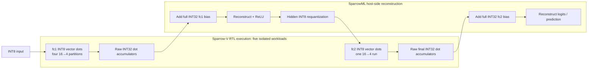

# Architecture

SparrowML is a hardware-aware edge-AI training, quantization, compilation, and runtime pipeline that deploys a subject-held-out WISDM activity-recognition model onto Sparrow-V, a custom RISC-V processor with INT8 vector execution. It preserves exact integer semantics across software reference inference, compiler-generated deployment packages, and RTL simulation.

## End-to-end pipeline

```mermaid
flowchart LR
  subgraph SW["SparrowML software"]
    A[WISDM raw accelerometer data] --> B[Subject-safe windows]
    B --> C[16-feature extraction]
    C --> D[FP32 MLP training]
    D --> E[INT8 calibration / quantization]
    E --> F[SparrowML IR]
  end
  subgraph ART["Generated artifacts"]
    F --> G[Binary deployment package]
  end
  subgraph RT["Sparrow-V runtime adapter"]
    G --> H[External fixed-shape workloads]
  end
  subgraph RTL["Sparrow-V RTL execution"]
    H --> I[INT8 vector-dot simulation]
  end
  I --> J[Exact reference validation]
```

The fixed model is `Linear(16,16) → ReLU → Linear(16,4)`. Input standardization and activation calibration use training subjects only. The package records `DenseLinearInt8`, `ReLU`, `RequantizeInt8`, and `DenseLinearInt8` with deterministic serialization and reload checks.

## Multi-layer execution boundary

The RTL interface has four output channels. SparrowML therefore runs `fc1` partitions in channels `0–3`, `4–7`, `8–11`, and `12–15`, then one `fc2` run. RTL produces zero-bias dot products; SparrowML reconstructs full INT32 bias, ReLU, and hidden requantization on the host. Exact comparisons cover post-bias `fc1` accumulators, hidden INT8 codes, post-bias `fc2` accumulators, and prediction.

Measured counters from these invocations are labelled as partitioned simulation totals. They are neither a monolithic scheduler nor optimized end-to-end latency. Sparrow-V owns processor RTL, simulator, instructions, testbenches, and execution counters; SparrowML does not modify that checkout.

## Earlier validation layers

The repository retains a deterministic synthetic fixture, dense INT8 reference path, and single-layer 2:4 sparsity/export/runtime experiments. These establish controlled contracts for the final WISDM flow. Their fixture accuracy, arithmetic-reduction, and cycle observations are not substituted for subject-held-out WISDM quality or sparse multi-layer performance.
